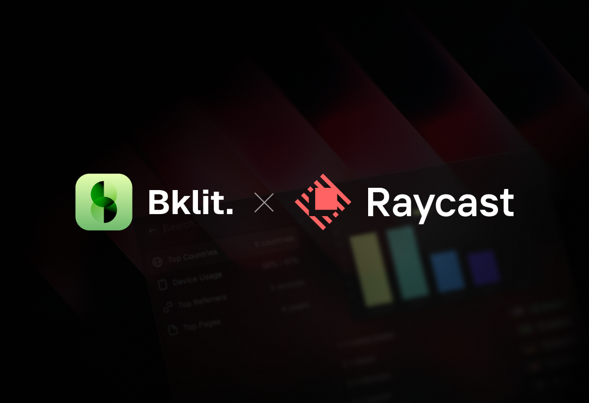

# Bklit Analytics Extension

Keep track of your website analytics right from your macOS menu bar. View comprehensive analytics including top countries, device usage, top pages, referrers, and more - all from the last 24 hours.

## Features

### Menu Bar Command

- 📊 **Live Pageview Count**: View total pageviews directly in your menu bar
- 🌍 **Top 5 Countries**: See your top countries with flags, views, and unique visitors
- 🔄 **Auto-refresh**: Data updates every 2 minutes automatically
- ⚡ **Lightning Fast**: Optimized ClickHouse queries (15-50ms response time)
- 🎨 **Light & Dark Mode**: Icons adapt to your system theme

### Analytics Snapshot Command

- 📈 **Top Countries**: Interactive view with visual charts and detailed stats
- 📱 **Device Usage**: Mobile vs Desktop breakdown with percentages
- 🔗 **Top Referrers**: See where your traffic comes from
- 📄 **Top Pages**: Most visited pages on your site
- 🎨 **Beautiful Charts**: QuickChart-powered visualizations
- ⌘R **Manual Refresh**: Update all data instantly

## Getting Started

### 1. Get Your API Credentials

Before using this extension, you'll need API credentials from your Bklit dashboard:

1. Log in to your [Bklit Dashboard](https://app.bklit.com)
2. Navigate to **Settings > API Tokens**
3. Click **Create New Token**
4. Assign the token to your project
5. Copy the API token (starts with `bk_live_`)
6. Go to your project settings and copy your **Project ID** (starts with `cl`)

### 2. Configure the Extension

After installing the extension:

1. Run **Bklit Analytics** from Raycast
2. You'll be prompted to enter your credentials:
   - **API Token**: Paste your Bklit API token
   - **Project ID**: Paste your project ID
   - **Dashboard URL** (optional): Leave blank for production or enter your custom URL

That's it! The extension will appear in your menu bar showing your analytics.

## Usage

### Menu Bar Command

The menu bar shows your total pageviews from the last 24 hours. Click to see:

- **Top 5 Countries**: Ranked by pageviews with flags and visitor counts
- **Quick Actions**:
  - Open your Bklit Dashboard
  - Refresh data manually (`⌘R`)
  - Access preferences (`⌘,`)

### Analytics Snapshot Command

Run **Show Analytics Snapshot** from Raycast to see:

- **Top Countries**: Visual bar chart with country flags and detailed metrics
- **Device Usage**: Pie chart showing mobile vs desktop distribution
- **Top Referrers**: Bar chart of your traffic sources
- **Top Pages**: Most visited pages with view counts

All sections include:

- Interactive charts powered by QuickChart
- Detailed metadata and percentages
- Quick actions to open dashboard or refresh data (`⌘R`)

## Privacy & Performance

- 🔒 Your API token is stored securely in Raycast's encrypted preferences
- ⚡ Optimized ClickHouse queries deliver data in 15-50ms
- 💾 Analytics data is cached locally for instant display
- 🔄 Menu bar updates every 2 minutes in the background
- 🚫 No data is collected or shared outside of Bklit
- 🌐 Supports custom dashboard URLs for self-hosted instances

## Support

Need help? Have questions?

- [Bklit Documentation](https://bklit.com/docs)
- [Report an Issue](https://github.com/bklit/bklit-raycast-extension/issues)

## License

MIT
