<p align="center">
  
</p>

<h1 align="center">DTF</h1>

<h3 align="center">
Browse posts, news, topics, and top blogs from DTF.ru with AI-powered features
</h3>

---

<p align="center">

[](https://deepwiki.com/shadeov/dtf-raycast)

</p>

Browse posts, news, and search on [DTF.ru](https://dtf.ru) — the leading Russian gaming and entertainment portal covering games, movies, TV shows, anime, and tech.

## Features

- 📰 **Latest Posts** — Fresh content from the DTF feed with sorting options
- 🔥 **Popular** — Trending and most discussed posts by time period
- 📢 **News** — Editorial news from the DTF team
- 🔍 **Search** — Instant search across all DTF content
- 🏷️ **Topics** — Browse by categories (Games, Movies & TV, Anime, etc.)
- 🏆 **Top Blogs** — Rating of popular user blogs with rankings
- 📊 **Menu Bar** — Highly customizable menu bar with 25+ preferences (macOS only)
- 🤖 **AI Features** — Summarize, translate, and extract key points via actions or `@dtf` mentions

## Commands

| Command | Description |
|---------|-------------|
| `Latest Posts` | Browse fresh posts from DTF feed |
| `Popular` | View popular and trending posts |
| `News` | Read news from editorial team |
| `Search` | Search posts across DTF |
| `Topics` | Browse posts by category |
| `Top Blogs` | Explore popular user blogs |
| `Menu Bar` | DTF in your menu bar (macOS only) |

## Screenshots

### Latest Posts

Browse the latest content with preview panel and sorting options.

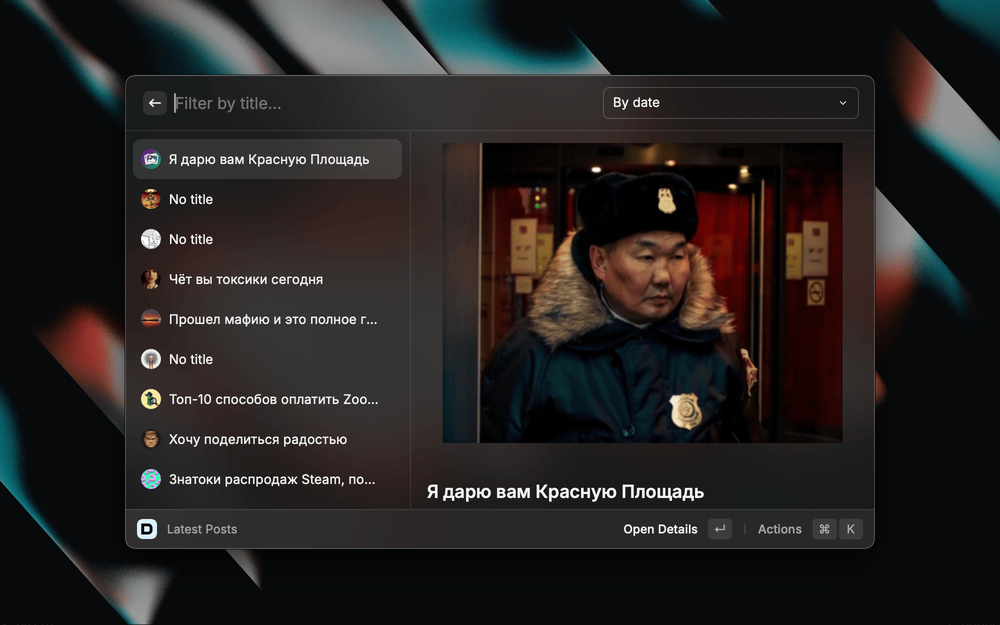

### Popular Posts

Discover trending posts filtered by time period (Today, Week, Month, All Time).

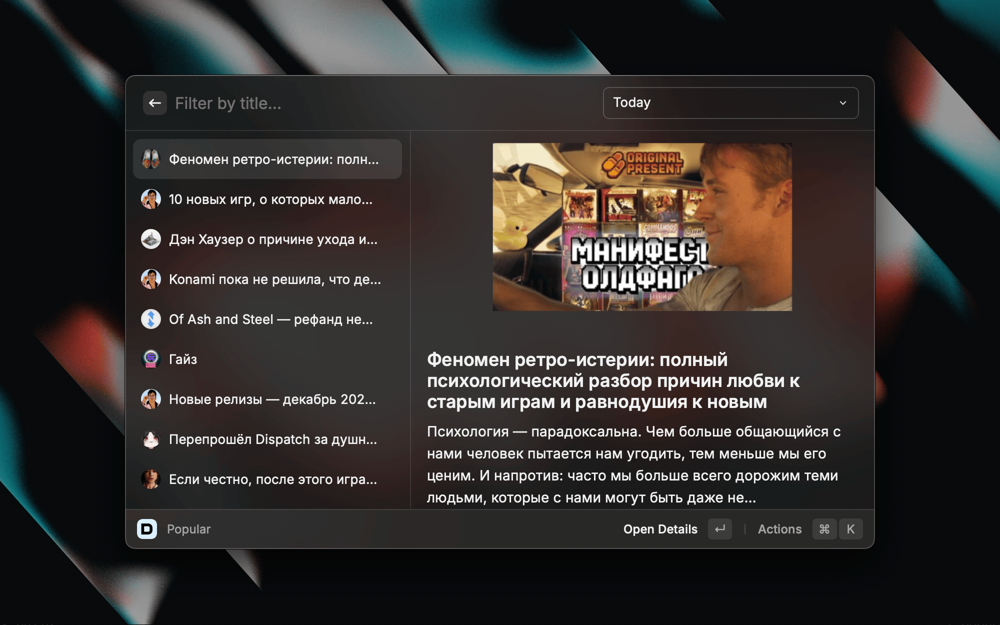

### News

Stay updated with editorial news from DTF.

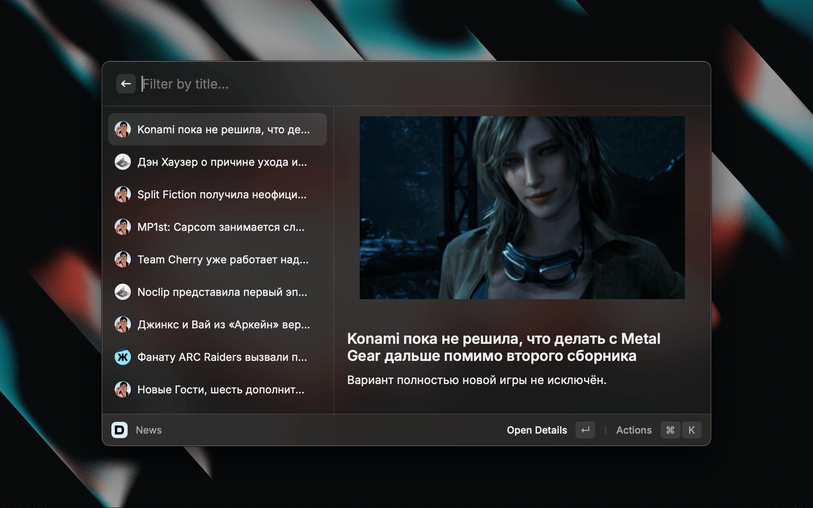

### Search

Find any content across DTF with instant search.

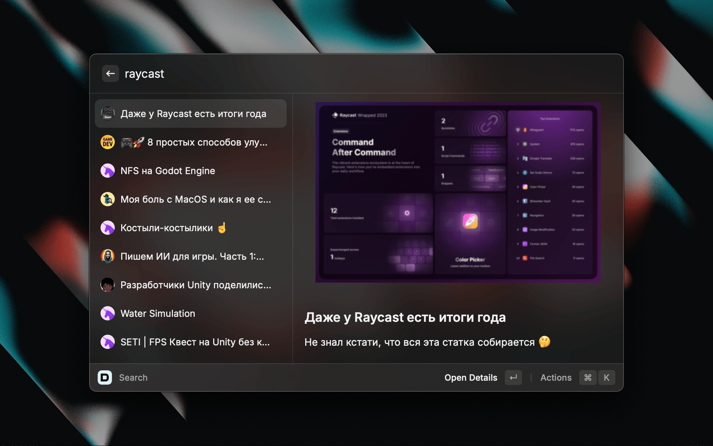

### Topics

Browse content by categories like Games, Movies & TV, Anime, and more.

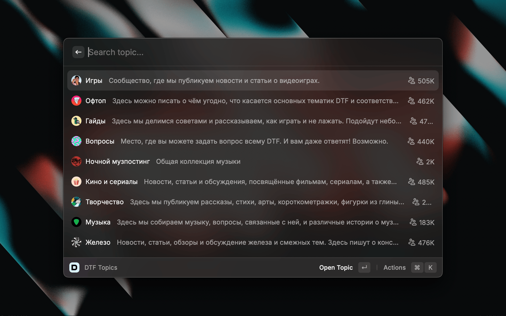

### Top Blogs

Explore the ranking of popular blogs with subscriber counts and activity stats.

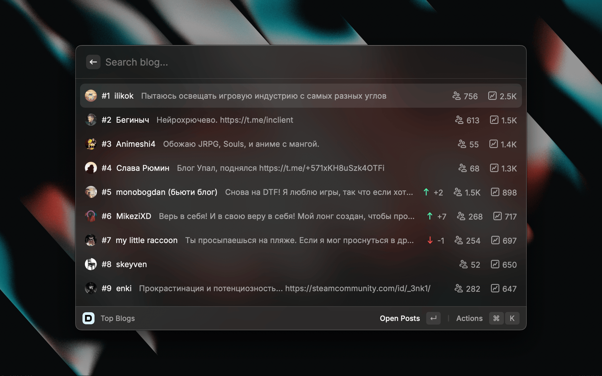

### Post Detail View

Full post view with rich content rendering, metadata, and AI actions.

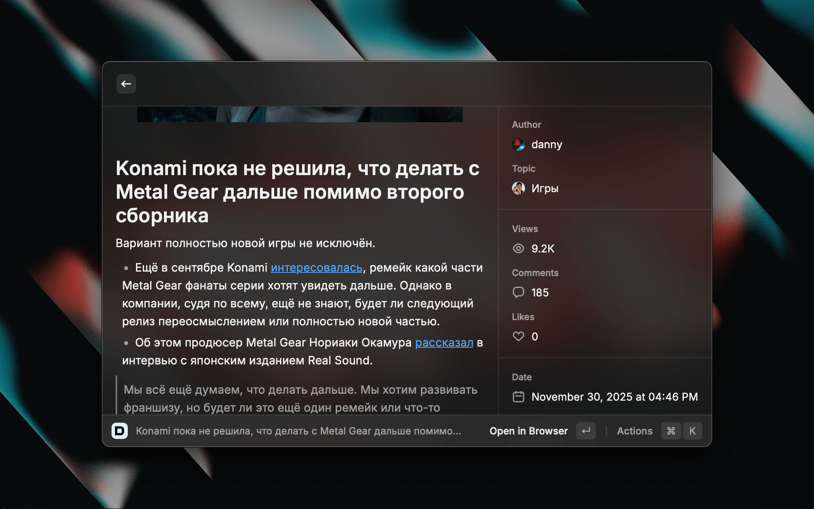

### Menu Bar (macOS)

Quick access to DTF content right from your menu bar with extensive customization.

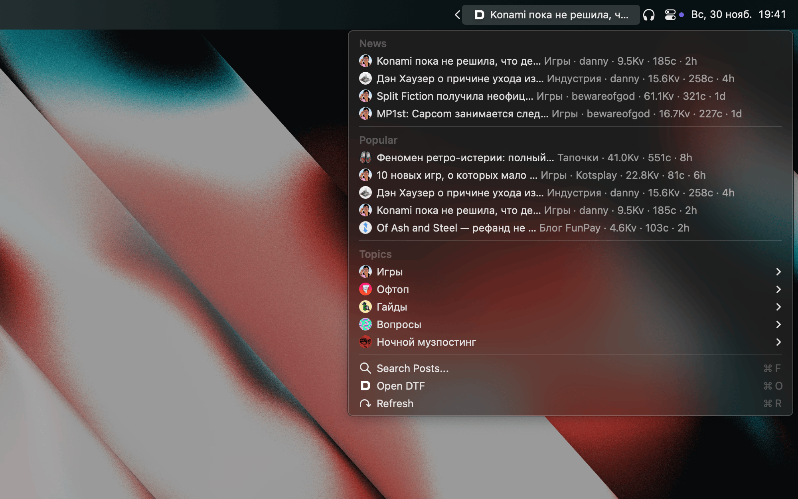

## Keyboard Shortcuts

### Post Actions (macOS)

| Shortcut | Action | Description |
|----------|--------|-------------|
| `↵` | Open Details | View full post content |
| `⌘ ↵` | Open in Browser | Open post on DTF.ru |
| `⌘ D` | Toggle Preview | Show/hide preview panel |
| `⌘ M` | Toggle Metadata | Show/hide metadata panel |
| `⌘ C` | Copy Link | Copy post URL to clipboard |
| `⌘ ⇧ C` | Copy Title | Copy post title to clipboard |

### Post Actions (Windows)

| Shortcut | Action | Description |
|----------|--------|-------------|
| `Enter` | Open Details | View full post content |
| `Ctrl + Enter` | Open in Browser | Open post on DTF.ru |
| `Ctrl + D` | Toggle Preview | Show/hide preview panel |
| `Ctrl + M` | Toggle Metadata | Show/hide metadata panel |
| `Ctrl + C` | Copy Link | Copy post URL to clipboard |
| `Ctrl + Shift + C` | Copy Title | Copy post title to clipboard |

### AI Actions (macOS)

| Shortcut | Action | Description |
|----------|--------|-------------|
| `⌘ S` | Summarize | Generate AI summary of the post |
| `⌘ T` | Translate | Translate post to English |
| `⌘ ⇧ K` | Key Points | Extract key points from the post |
| `⌘ ⇧ S` | Quick TLDR | Generate one-line summary (copies to clipboard) |

### AI Actions (Windows)

| Shortcut | Action | Description |
|----------|--------|-------------|
| `Ctrl + S` | Summarize | Generate AI summary of the post |
| `Ctrl + T` | Translate | Translate post to English |
| `Ctrl + Shift + K` | Key Points | Extract key points from the post |
| `Ctrl + Shift + S` | Quick TLDR | Generate one-line summary (copies to clipboard) |

### Menu Bar Shortcuts (macOS only)

| Shortcut | Action |
|----------|--------|
| `⌘ F` | Search Posts |
| `⌘ O` | Open DTF |
| `⌘ R` | Refresh |

## List Views Features

All list commands (Latest, Popular, News, Topics, Top Blogs) include:

- **Preview Panel** — See post content, images, and metadata without opening
- **Metadata Toggle** — Show/hide detailed statistics
- **Local Filtering** — Filter posts by typing in the search bar
- **Pagination** — Automatic loading of more posts as you scroll
- **Sorting Options** — Sort by date, popularity, or relevance

### Sorting Options by Command

| Command | Available Sorting |
|---------|------------------|
| Latest Posts | Date, Hotness |
| Popular | Today, Week, Month, All Time |
| Topics (posts) | New, Popular |
| Top Blogs (posts) | New, Popular |

## AI Features

The extension integrates with Raycast AI to provide intelligent post analysis.

### AI Actions in Posts

Access AI features from any post via action panel:

#### Summarize

Generate a 2-3 paragraph summary of any post, keeping the original language.

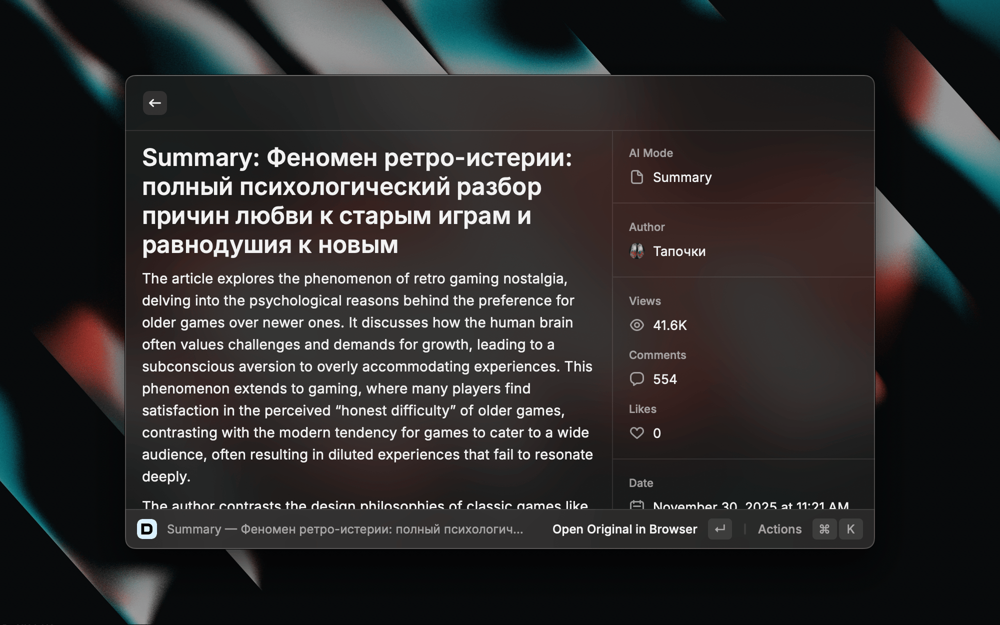

#### Translate to English

Translate the full post content to English while preserving structure.

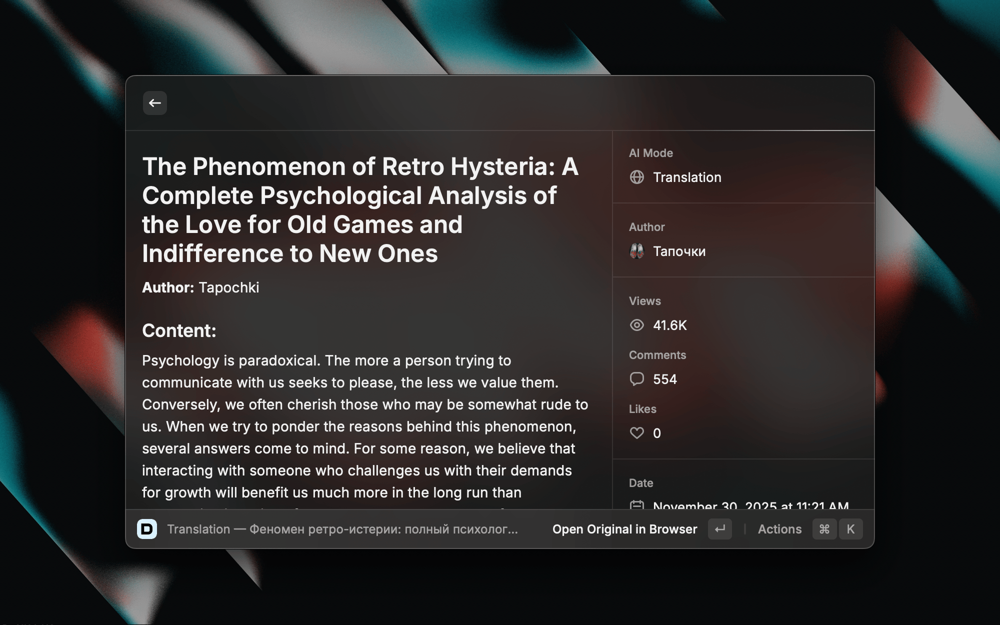

#### Extract Key Points

Get 3-5 bullet points highlighting the main information.

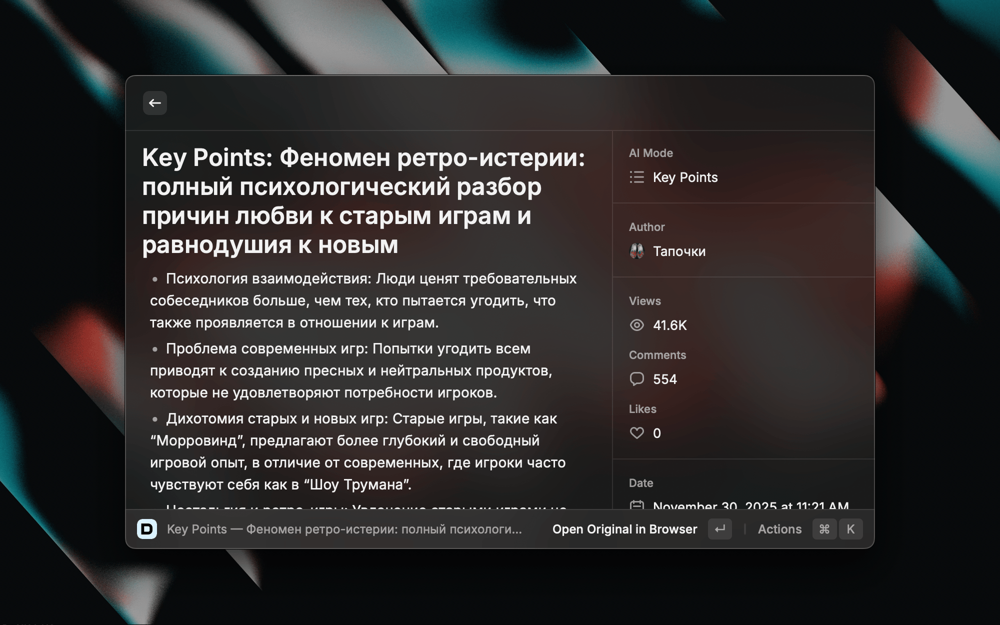

#### Quick TLDR

One-sentence summary copied directly to your clipboard — perfect for quick sharing.

### AI Tools via @dtf Mentions

You can also use AI to query DTF directly in any Raycast AI chat by mentioning `@dtf`:

| Query | What it does |
|-------|--------------|
| `@dtf What are the main news today?` | Fetches and summarizes latest news |
| `@dtf What's popular this week?` | Shows trending posts from the past week |
| `@dtf Find posts about Baldur's Gate 3` | Searches for specific content |
| `@dtf What categories are available?` | Lists all topics on DTF |
| `@dtf Show me latest posts about games` | Gets posts from Games topic |

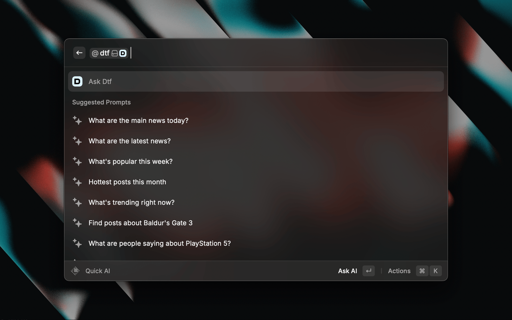

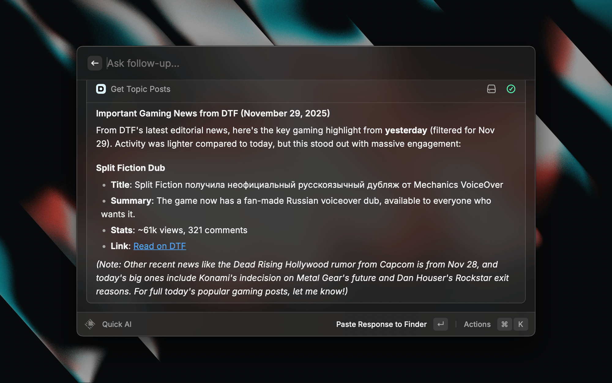

## Menu Bar Command

> ⚠️ **macOS only** — Menu Bar is not available on Windows due to Raycast platform limitations.

The Menu Bar command is **highly customizable** with **25+ preferences** to tailor the experience to your needs.

### Display Options

| Preference | Options | Description |
|------------|---------|-------------|
| Menu Bar Display | Icon only, Post count, Latest post title, Top post stats | What to show next to the icon |
| Title/Stats Source | News, Popular, Latest | Source for title or stats display |
| Title Length | 15, 25, 35, 50 chars | Maximum length for menu bar title |
| Stats Format | Shortest, Short, Full | How to display views/comments |
| Title Rotation | Off, 5/10/15/30 min | Rotate between posts |

### Sections Configuration

| Section | Default | Description |
|---------|---------|-------------|
| News | ✅ On | Latest editorial news |
| Popular | ✅ On | Trending posts |
| Latest | Off | Fresh posts from feed |
| Topics | Off | Posts by category (submenu) |
| Top Blogs | Off | Posts from popular blogs (submenu) |
| More | Off | Navigation to other commands |

### Posts Count per Section

| Section | Options |
|---------|---------|
| News | 4, 8, 12 posts |
| Popular | 3, 5, 7, 10 posts |
| Latest | 3, 5, 7, 10 posts |
| Topics | 1, 2, 3, 5 posts per topic |
| Top Blogs | 1, 2, 3, 5 posts per blog |

### Post Display Options

| Preference | Default | Description |
|------------|---------|-------------|
| Show Category | Off | Display category/topic name |
| Show Authors | Off | Display author name |
| Show Views | ✅ On | Display view count |
| Show Comments | ✅ On | Display comment count |
| Show Time | ✅ On | Display publication time |
| Compact Titles | ✅ On | Truncate long titles |
| Post Title Length | 30, 50, 70, 100 chars | Maximum title length |
| Post Icons | ✅ On | Show subsite/author avatars |

### Actions Configuration

| Preference | Options |
|------------|---------|
| Primary Action | Open in Browser, Copy URL |
| Show Open DTF | ✅ On — Open DTF.ru in browser |
| Show Refresh | ✅ On — Refresh menu bar content |
| Show Search | ✅ On — Open Search command |

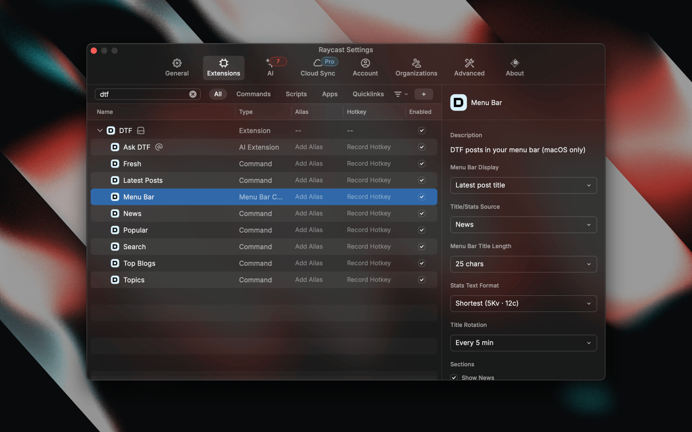

## Browse by Topics

Browse posts by popular categories:

- 🎮 Games
- 🎬 Movies & TV
- 📺 Anime
- 💻 Tech
- 🎨 Gamedev
- And more...

Each topic shows subscriber count and allows browsing posts with sorting options.

## Explore Top Blogs

Explore the rating of popular user blogs featuring:

- 🏅 **Rank position** with change indicators (↑ up, ↓ down, NEW)
- 👥 **Subscriber count**
- 📈 **7-day activity stats**
- 📝 **Recent posts** from each blog

## Post Content

The extension renders rich post content including:

- Text with formatting (bold, italic, links)
- Images and galleries
- YouTube and Vimeo embeds
- Code blocks
- Quotes and incuts
- Lists (ordered and unordered)
- Polls/quizzes
- Embedded DTF posts
- Audio content
- Person cards

## Installation

### From Raycast Store

Search for "DTF" in Raycast Store and click Install.

### Manual Installation

```bash
# Clone the repository
git clone https://github.com/Shadeov/dtf
cd dtf

# Install dependencies
npm install

# Run in development mode
npm run dev
```

## API

The extension uses the public DTF API (Osnova platform):

| Endpoint | Description |
|----------|-------------|
| `/v2.10/timeline` | Posts feed |
| `/v2.10/feed` | Feed by categories |
| `/v2.10/news` | Editorial news |
| `/v2.10/search` | Search |
| `/v2.10/discovery/topics` | Topics list |
| `/v2.10/discovery/blogs` | Top blogs |

## Requirements

- macOS 12.0+ or Windows
- Raycast 1.50+

## Changelog

See [CHANGELOG.md](CHANGELOG.md) for version history.

## License

MIT

## Author

**Shadeov** — [GitHub](https://github.com/shadeov)
