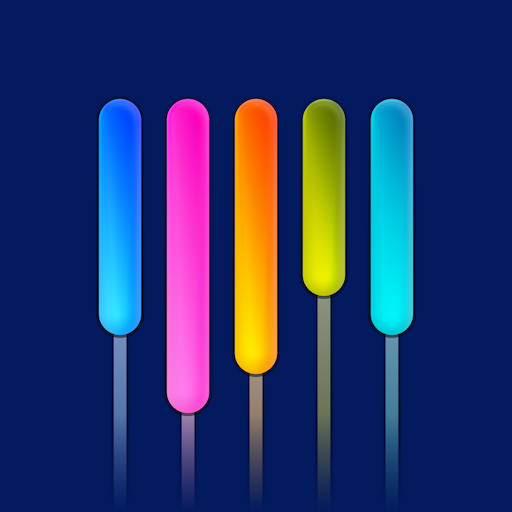

    

# Fizzy

This is a [Raycast](https://www.raycast.com/) extension for [Fizzy](https://fizzy.do/) - _Kanban as it should be. Not as it has been._

## ⚙️ Configuration

- **Fizzy URL** - The URL of your Fizzy instance
- **API Token** - `Check` GitHub for detailed intructions ([Personal Access Tokens](https://github.com/basecamp/fizzy/blob/main/docs/API.md#personal-access-tokens))
- **Account Slug** - `Get` this from your Fizzy account

---

### 👀 Interested in self-hosting Fizzy? Try these:

