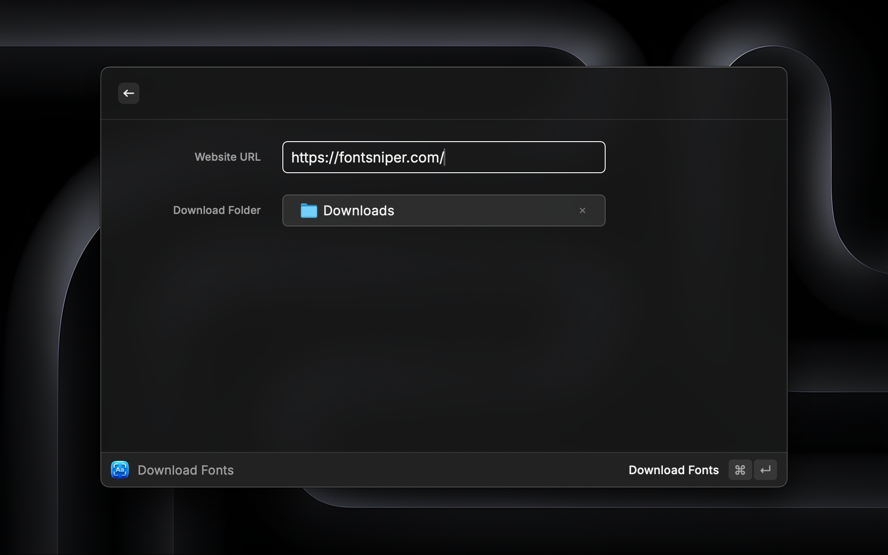
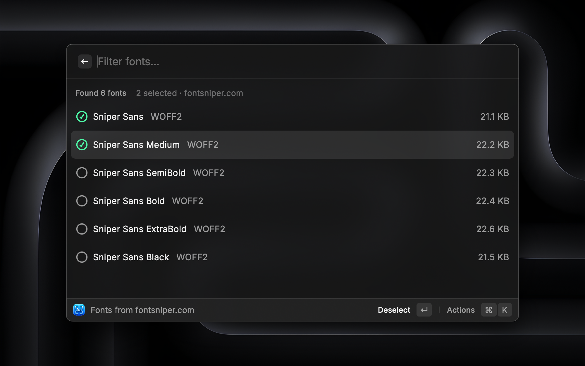

# Font Sniper

A Raycast extension to identify and download fonts from websites.

## Features

- Extract fonts from any website URL
- Support for WOFF2, WOFF, TTF, OTF, and EOT formats
- Auto-convert WOFF2 to TTF for desktop use
- Filter by format preferences
- Batch download selected fonts

## Screenshots

## Disclaimer

FontSniper is a developer utility designed to help designers and developers inspect and access publicly available font assets for testing and research purposes.

- **Respect Licenses:** Many web fonts are licensed software. Downloading a font does not grant you a license to use it. You are responsible for ensuring you have the appropriate rights or licenses for any font you download and use.

- **No Circumvention:** This tool only detects files that are already sent to your browser for rendering. It does not bypass DRM, decrypt secured files, or access private directories.

- **User Responsibility:** The author of this extension assumes no liability for the misuse of downloaded assets. Please support type foundries by purchasing proper licenses for your projects.
