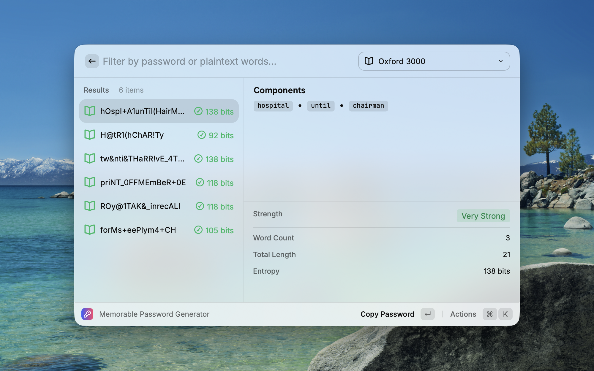

# Memorable Password Generator

  

A powerful Raycast extension that generates strong, memorable passwords using meaningful word combinations. Balance security with memorability through customizable word lists, intelligent character substitution, and flexible configuration options.

## ✨ Features

### 🌏 Multi-Language Support

- **Bilingual Interface**: Seamlessly switch between English and Chinese
- **Auto-Detection**: Automatically adapts to your system language

### 📚 Diverse Word Lists

Choose from 6 curated word sources to match your preferences:

- **Oxford 3000**: Core English vocabulary for maximum memorability
- **Chinese Idioms (成语)**: Traditional four-character expressions
- **Chinese Poetry (诗词)**: Classical Chinese poetic phrases
- **Technology**: Tech-related terms for developers
- **Nature & Geography**: Natural world vocabulary
- **Custom**: Use your own word list file

### 🔄 Smart Character Processing

- **Pinyin Conversion**: Automatically converts Chinese characters to Pinyin for universal compatibility
- **Leet Speak**: Optional character substitution for enhanced security (e.g., `a→@`, `e→3`, `s→$`)

### 🎨 Advanced Configuration

- **Flexible Separators**: Customize word separators (`-`, `_`, `.`, etc.)
- **Casing Modes**:
  - Lowercase: `word-word-word`
  - Uppercase: `WORD-WORD-WORD`
  - PascalCase: `Word-Word-Word`
  - Random: `WoRd-wOrD-WoRd`
- **Prefix/Suffix**: Add custom strings to all generated passwords
- **Batch Generation**: Create multiple password options at once

### 🔒 Security Indicators

- **Entropy Display**: Visual strength indicators with bit entropy calculation
- **Color Coding**: Instant visual feedback on password strength
- **Detailed Metadata**: Word count, total length, and security metrics

## 📖 Usage

1. **Launch**: Open Raycast and type "Memorable Password Generator"
2. **Configure**:
   - Set word count (default: 3)
   - Choose number of passwords to generate (default: 6)
   - Select word list from dropdown
   - Optionally specify separator
3. **Generate**: Press Enter to create passwords
4. **Copy**: Click any password to copy it to clipboard
5. **Customize**: Access preferences (⌘,) for advanced options

### Quick Tips

- Use **⌘R** to regenerate passwords
- Use **⌘⇧C** to copy plaintext word sequence
- Switch word lists on-the-fly using the dropdown menu

## 🔐 Security Philosophy

We balance two critical factors in password design:

### Memorability

Passwords composed of actual words are easier to remember than random character strings. By using curated word lists like Oxford 3000, users can create passwords that stick in memory without needing to write them down.

### Robustness

Strong passwords resist brute-force attacks through:

- **Length**: Multiple words create longer passwords
- **Complexity**: Leet speak and mixed casing add character variety
- **Entropy**: High bit entropy ensures cryptographic strength

**Example**: `Sunset-Mountain-River` → `Suns3t@M0unt@in-R1ver!`

## 📊 Technical Details

### Leet Speak Character Mapping

| Original | Number | Symbol |
|----------|--------|--------|
| a        | 4      | @      |
| b        | 8      | -      |
| c        | -      | (      |
| e        | 3      | &      |
| g        | 9      | -      |
| i        | 1      | !      |
| l        | 1      | -      |
| o        | 0      | -      |
| s        | 5      | $      |
| t        | 7      | +      |
| z        | 2      | -      |

### Word List Caching

Word lists are cached in memory for optimal performance, ensuring fast password generation even with large vocabularies.

## 🤝 Contributing

Contributions are welcome! Feel free to:

- Report bugs or issues
- Suggest new features or word lists
- Submit pull requests
- Improve documentation

Visit the [GitHub Repository](https://github.com/gandli/extensions) to get started.

## 📝 Changelog

See [CHANGELOG.md](./CHANGELOG.md) for version history and updates.

## 👤 Author

**gandli**

- GitHub: [@gandli](https://github.com/gandli)

## 📜 License

This extension is licensed under the [MIT License](https://opensource.org/licenses/MIT).

---

  <strong>⚠️ Security Note</strong> 
  While this extension generates strong passwords, always use a password manager for storing and managing your credentials.

