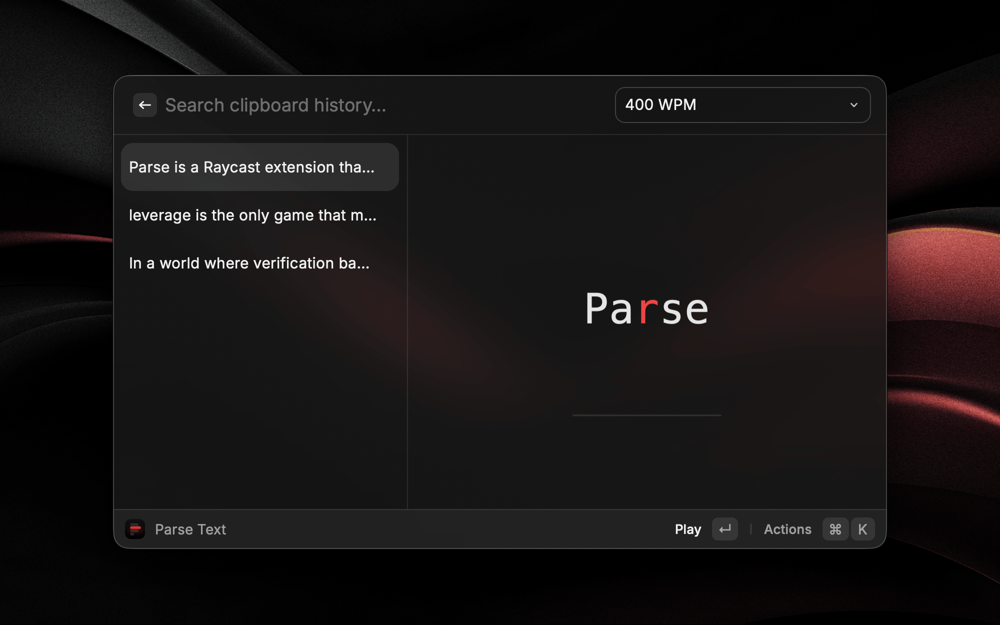
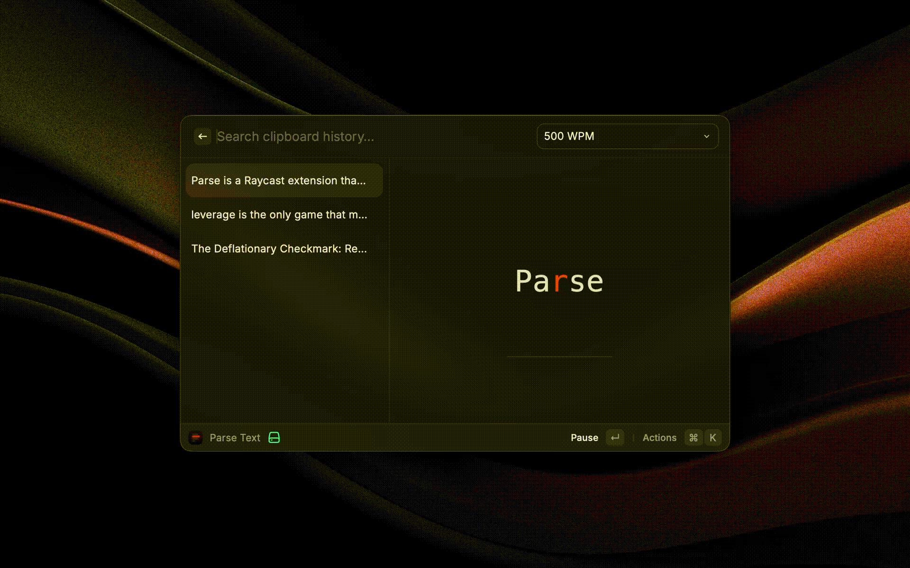

## Parse is a Raycast extension that lets you speed read any copied text using RSVP (Rapid Serial Visual Presentation) technique.

## Features

- **Speed Reading**: Read text at 300-700 WPM using RSVP technique
- **Clipboard Integration**: Automatically detects copied text
- **Visual Focus**: Highlights the Optimal Recognition Point (ORP) for faster reading
- **Progress Tracking**: Visual progress bar shows reading position
- **Customizable Speed**: Adjust reading speed on the fly
- **Keyboard Controls**: Play/pause with spacebar, navigate with shortcuts

## How to Use

1. Copy any text to your clipboard
2. Open Parse from Raycast
3. Text automatically starts playing at your preferred speed
4. Press `Space` to pause/play
5. Adjust WPM using the `⌘P` dropdown

## Keyboard Shortcuts

- `Space` - Play/Pause
- `⌘ + P` - Change WPM
- `⌘ + C` - Copy text
- `⌘ + D` - Delete item

## Demo

## Notes

- Based on [this tweet from Oliur](https://x.com/UltraLinx/status/2011434505253650868)
- Ping [`@traf`](https://x.com/traf) with any ideas/feedback
