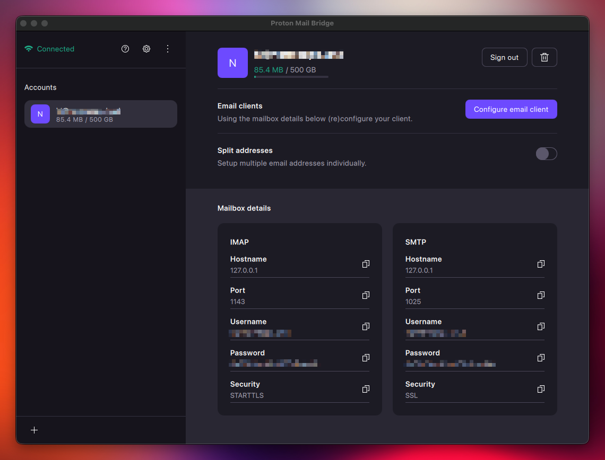

# Proton Mail

View and manage your Proton Mail inbox directly in Raycast via Proton Mail Bridge.

## Features

- **Email List View** - Browse emails with subject, sender, date, and read/unread status
- **Email Detail View** - Read full email content in a detail pane
- **Folder Navigation** - Switch between Inbox, Sent, Drafts, Archive, Trash, and custom folders/labels
- **Filtering** - Filter emails by All, Unread, Read, or Has Attachment
- **Compose Email** - Write new emails or Reply, Reply All, and Forward
- **Pagination** - Load more emails as needed with configurable page size
- **Attachments** - Download individual attachments or all at once
- **Quicklinks** - Save current folder/filter view as a Raycast quicklink
- **Open in Proton Mail** - Jump to the email in Proton Mail web interface (uses search as a workaround since direct email links aren't available)
- **Expanded Email View** - Read emails in full-screen with metadata sidebar
- **Demo Mode** - Anonymize email data for screenshots and demos
- **Email Actions**:
  - Reply / Reply All / Forward (with compose form)
  - Mark as Read / Unread
  - Archive
  - Delete
  - Download Attachments
  - Copy subject, sender, or email body (plain text or markdown)
  - Save as Quicklink

## Requirements

1. **Proton Mail Bridge** must be installed and running on your Mac
2. A Proton Mail account (paid subscription required for Bridge)

> **Note:** This extension currently supports one account/address at a time.

## Setup

1. Install and configure [Proton Mail Bridge](https://proton.me/mail/bridge)
2. Sign in to your Proton account in Bridge
3. Open the extension preferences in Raycast and enter your Bridge settings:
   - **IMAP Hostname**: Usually `127.0.0.1`
   - **IMAP Port**: Usually `1143`
   - **SMTP Hostname**: Usually `127.0.0.1`
   - **SMTP Port**: Usually `1025`
   - **Username**: Your Proton Mail email address
   - **Password**: The Bridge-generated password (found in Bridge app, NOT your Proton account password)
   - **Emails to Load**: Number of emails per page (25, 50, 100, or 200)

## How to Find Your Bridge Settings

1. Open Proton Mail Bridge
2. Click on your account
3. Look for "Mailbox details" section
4. Copy the IMAP and SMTP settings shown

## Filtering

The extension provides a single dropdown that combines:

- **Folder selection** (Inbox, Sent, Drafts, etc.)
- **Status filters** (All, Unread, Read, Has Attachment)

Select a folder first, then use the filter section to narrow down emails.

## Pagination

The extension loads emails in pages based on your "Emails to Load" preference. Press ⌘L or select "Load More Emails" from the action menu to fetch older emails.

## Attachments

When viewing an email with attachments:

1. Select "Download Attachments" from the action menu
2. Choose to download a single attachment or all attachments
3. Single files are saved to `~/Downloads/`
4. Multiple files are saved to a timestamped folder: `~/Downloads/proton-attachments-YYYYMMDDTHHMMSS/`

## Quicklinks

Save your frequently used views as Raycast quicklinks:

1. Navigate to a folder and apply a filter
2. Press ⌘⇧S or select "Save Current View as Quicklink"
3. The quicklink will open directly to that folder/filter combination

## Demo Mode

For taking screenshots or showing the extension to others, enable Demo Mode (⇧⌘D) to anonymize all email data:

- Names are replaced with sample names (Alice Johnson, Bob Smith, etc.)
- Email addresses become example.com addresses
- Subjects are replaced with generic titles
- Email body content is replaced with placeholder text

Toggle it off with the same shortcut when done.

## Keyboard Shortcuts

| Action | Shortcut |
|--------|----------|
| Reply | ⌘R |
| Reply All | ⇧⌘R |
| Forward | ⌘F |
| Mark Read/Unread | ⇧⌘U |
| Archive | ⌘E |
| Delete | ⌘⌫ |
| Copy Subject | ⌘C |
| Copy Sender | ⇧⌘C |
| Save as Quicklink | ⇧⌘S |
| Download Attachments | ⌘D |
| Load More Emails | ⌘L |
| Expand Email | ⌘↩ |
| Toggle Demo Mode | ⇧⌘D |
| Copy as Markdown | ⇧⌘M |
| Compose New Email | ⌘N |