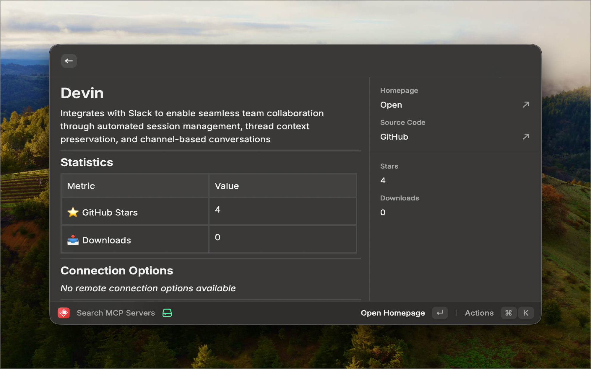

# PulseMCP for Raycast

Search and discover MCP (Model Context Protocol) servers from the [PulseMCP](https://www.pulsemcp.com/) registry directly in Raycast.

  

## Features

- **Search MCP Servers** - Find servers by name, description, or functionality
- **Sort Results** - Sort by stars, downloads, or name
- **View Server Details** - See stats, connection options, transport types, and AI-generated descriptions
- **Quick Actions** - Open homepage, view source code, setup guides, copy server names
- **Transport Tags** - See at a glance if servers support SSE, stdio, or other transports
- **Real-time Data** - Powered by the PulseMCP API with live registry data

## Commands

| Command | Description |
|---------|-------------|
| Search MCP Servers | Browse and search the PulseMCP server registry |

## Keyboard Shortcuts

| Shortcut | Action |
|----------|--------|
| `↵` | View server details |
| `⌘ ↵` | Open homepage |
| `⌘ C` | Copy server name |
| `⌘ ⇧ C` | Copy source URL |
| `⌘ R` | Refresh results |

## About PulseMCP

[PulseMCP](https://www.pulsemcp.com/) collects and enriches MCP-related data from around the web, providing a comprehensive registry of Model Context Protocol servers. This extension uses their [public API](https://www.pulsemcp.com/api) to search and display server information.

## License

MIT
