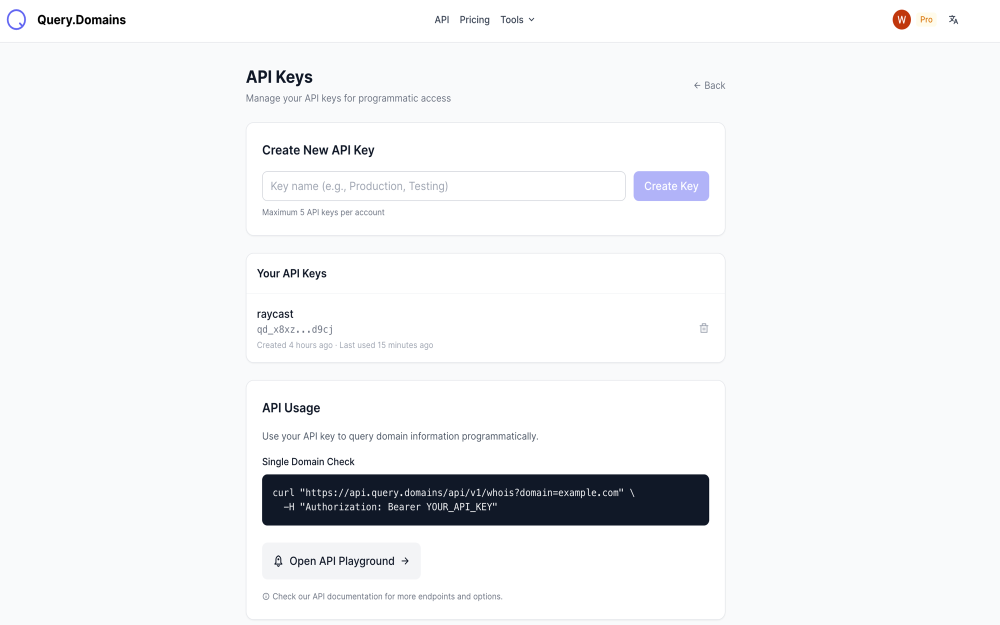
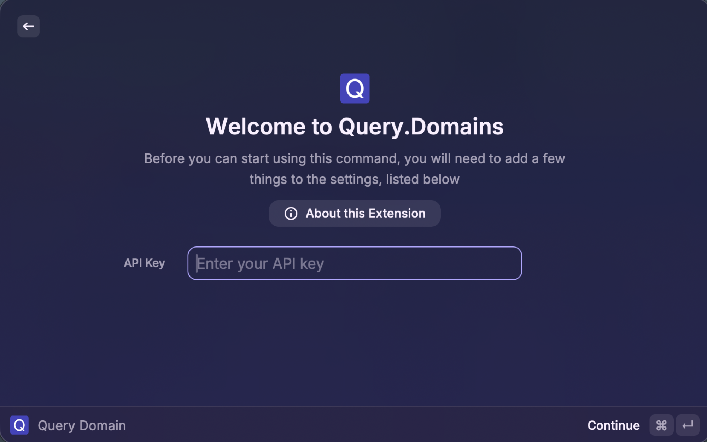
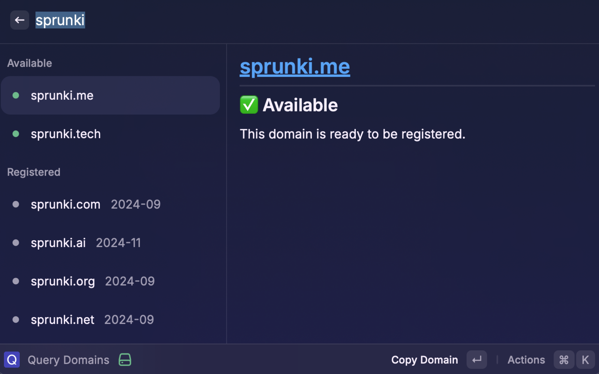
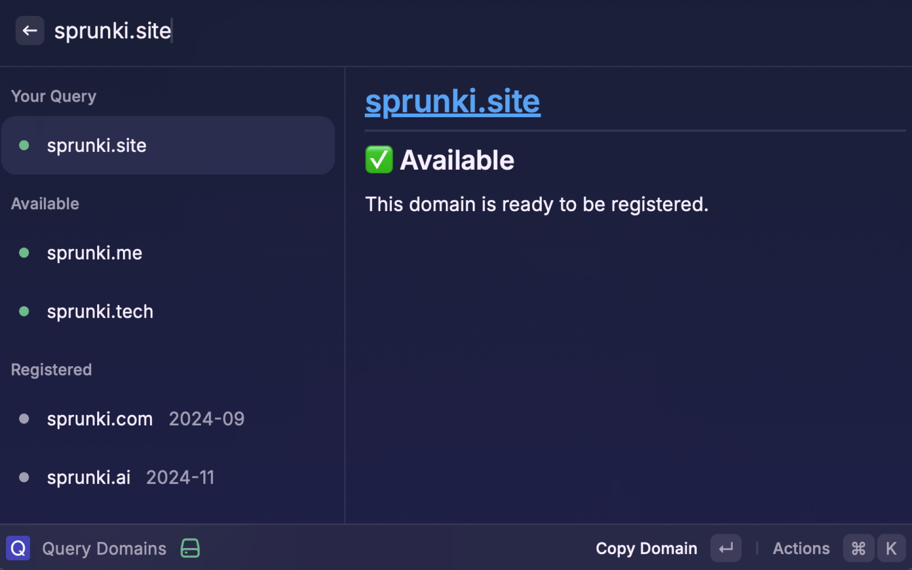
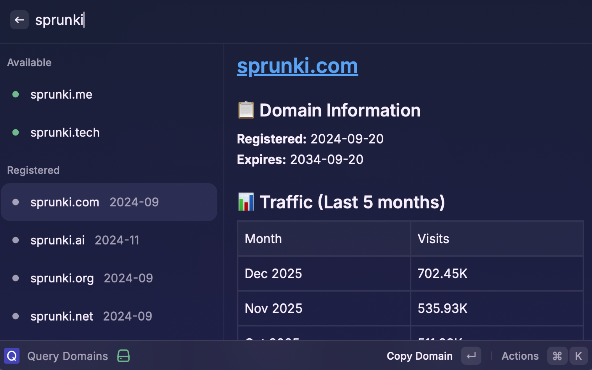
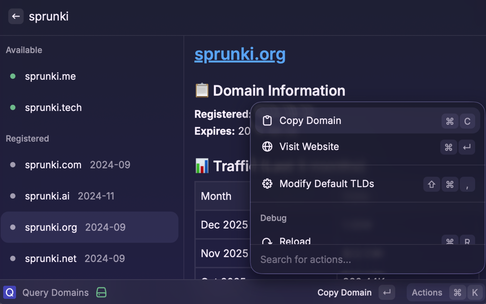

# Query.Domains

Check domain availability, WHOIS information, and traffic data for multiple TLDs at once.

## Features

- **Bulk Domain Check**: Enter a keyword and instantly check availability across 12+ TLDs
- **Custom TLD Lists**: Configure your own list of TLDs to check
- **Smart Detection**: Enter a full domain (e.g., `example.xyz`) and it will be checked alongside your default TLDs
- **WHOIS Information**: View registration and expiration dates for registered domains
- **Traffic Data**: See monthly visitor statistics for registered domains
- **Quick Actions**: Copy domains, visit websites, and manage settings with keyboard shortcuts

## Setup

### 1. Get Your API Key

You need a query.domains API key to use this extension.

1. Visit [query.domains](https://query.domains)
2. Sign up for an account or log in
3. Navigate to [API Keys page](https://query.domains/account/api-keys)
4. Copy your API key

### 2. Install and Configure

1. Install the extension from Raycast Store
2. Open the extension for the first time
3. You'll be prompted to enter your API Key
4. Paste your API key and confirm

### 3. (Optional) Customize TLD List

1. Open Raycast preferences: `⌘ ,`
2. Navigate to Extensions → Query Domains
3. Edit the "TLD List" field with your preferred TLDs (comma-separated)
4. Default: `com,ai,org,net,io,app,dev,xyz,co,me,tech,online`

## Usage

### Basic Search

1. Open Raycast and type `Query Domains` or your configured shortcut
2. Enter a keyword (e.g., `mycompany`)
3. The extension will check availability for all configured TLDs

### Check Specific TLD

1. Enter a full domain name (e.g., `mycompany.xyz`)
2. If `.xyz` is not in your default list, it will be checked first
3. Your default TLDs will also be checked

### View Domain Details

1. Select any domain from the results
2. The detail panel shows:
   - **Available domains**: Ready-to-register status
   - **Registered domains**: Registration date, expiration date, and monthly traffic stats

## Keyboard Shortcuts

- `↵ Enter` - Visit domain website in browser
- `⌘ C` - Copy domain name to clipboard
- `⌘ ⇧ ,` - Open extension preferences to modify TLD list

## Screenshots

### Main Interface

## API Information

This extension uses the [query.domains API](https://query.domains) to fetch domain availability, WHOIS, and traffic data.

## Privacy

Your API key is stored securely in Raycast's preferences and is only used to authenticate with the query.domains API. No other data is collected or transmitted.

## Support

If you encounter any issues or have suggestions, please:
- Open an issue on GitHub
- Contact the developer via Raycast Store

## License

MIT
