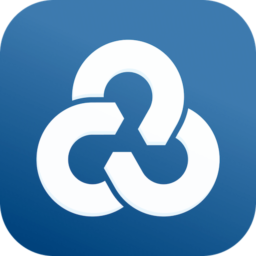

# Rclone

> Control rclone's Remote Control daemon (RC) from Raycast

 <p align="center">
    
</p>

**Browse && create remotes, start jobs, and manage mounts without leaving the command palette.**

## Features

- **Remote inventory** – list every remote defined in `rclone.conf`, preview its options, inspect mount points, and trigger edits or deletion inline.
- **Guided remote creation** – fetch provider metadata from `/config/providers`, surface both basic and advanced fields, and validate inputs before creating a new remote.
- **One-click daemon management** – the `Start Daemon` command checks for a running RC server, launches `rclone rcd --rc-no-auth` when needed, and can stop the spawned process.
- **Operation catalog** – run `mount`, `copy`, `copyfile`, `copyurl`, `sync`, `move`, `movefile`, `delete`, `deletefile`, and `purge` with forms that prefill flag defaults from your global rclone config.
- **Smart flag editing** – filter, performance, networking, and validation flags are grouped with inline docs, only send overrides that differ from defaults, and execute jobs asynchronously so Raycast stays responsive.

## Requirements

1. [Raycast](https://raycast.com) with this extension installed.
2. [`rclone`](https://rclone.org/downloads/) available on your `$PATH` (v1.63 or newer recommended).
3. An RC daemon reachable at `http://localhost:5572`

**Windows users:** Make sure `rclone.exe` is in your system PATH. For mount operations, you'll need [WinFsp](https://winfsp.dev/) installed.

Start the daemon manually:

```bash
rclone rcd --rc-no-auth
```

…or launch the **Start Daemon** command from this extension, which spawns the same process, verifies it’s reachable, and reports its status without leaving Raycast.

## Getting Started

1. **Install** – add the rclone extension from the Raycast Store (or `ray install` while developing).
2. **Launch the daemon** – use the included `Start Daemon` command or run `rclone rcd --rc-no-auth` yourself.
3. **Manage remotes** – open `List Remotes` to inspect, edit, delete, or view mount points; use `Create Remote` for new backends.
4. **Run operations** – open `Run Operation`, pick an action, review optional flags, and submit. Each job calls the matching RC endpoint (for example `/sync/copy` for Copy) and displays success/failure toasts.

## Commands

| Command         | Purpose                                                                                   |
| --------------- | ----------------------------------------------------------------------------------------- |
| `List Remotes`  | Browse remotes, open details, inspect mount points, and jump into edit or operation flows |
| `Create Remote` | Guided creation form with provider metadata, advanced options, and validation             |
| `Run Operation` | Catalog of RC operations (mount/copy/sync/move/delete/purge variants) with flag controls  |
| `Start Daemon`  | Ensure `rclone rcd --rc-no-auth` is running; view status and stop the spawned process     |

## Tips

- Remote detail views surface current mount points from `/mount/listmounts` so you can unmount without touching the CLI.
- Operation forms pull global defaults from `/options/get`, so you only override what matters; filters live under their own section for clarity.
- Every action hits the RC HTTP API via [`rclone-sdk`](https://www.npmjs.com/package/rclone-sdk). If calls start failing, confirm the daemon is reachable at `http://localhost:5572`.
